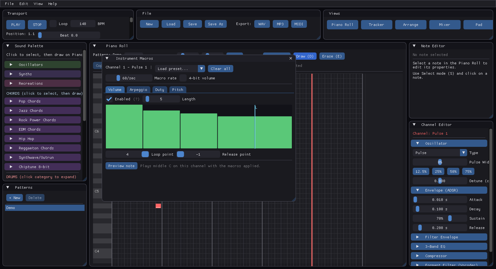

# Chiptune Tracker

A tracker-style DAW for creating authentic chiptune music, built from scratch in C++20.

## Overview

Chiptune Tracker is a lightweight, real-time digital audio workstation designed for composing retro-style music. It emulates the distinctive sounds of vintage hardware like the NES 2A03 and Game Boy LR35902 using mathematically accurate synthesis.

### Design Philosophy

- **Zero allocations in the audio thread** - Lock-free ring buffers for UI-to-audio communication
- **PolyBLEP antialiased oscillators** - Alias-free square, sawtooth, and triangle waves
- **LFSR noise generation** - Authentic NES-style percussion
- **Minimal dependencies** - Only miniaudio + Dear ImGui

## Screenshots

### Piano roll

Draw notes directly, or place whole chords and drum patterns from the sound
palette. Sixty-five instruments across oscillators, synths, drums and genre
kits.


### Instrument macros

The heart of chiptune sound design. Four step sequences per instrument -
volume, arpeggio, duty cycle and fine pitch - each with its own loop and
release point. Drag across the bar graph to draw the shape; a `0 4 7`
arpeggio macro fakes a whole chord on a single channel.



### Mixer

Eight channels with per-channel level metering, pan, mute and solo, and a
full effects chain behind each one.


### Tracker view

The classic hex grid, for when you would rather type than draw.


### Arrangement

Lay patterns out along a timeline to build the full song structure.


### Pad controller

MPC-style pads for playing drums and auditioning sounds live.


### Themes

Ten themes, several with animated backgrounds. The theme reaches the piano
roll and the custom widgets, not just the window chrome.

| Game Boy DMG | Matrix |
|---|---|
|  |  |

| Retro Terminal | Daylight |
|---|---|
|  |  |

Also included: Stock, Cyberpunk, Synthwave, Frutiger Aero, Minimal and
Vaporwave.

*Screenshots are generated from the app itself with
`tools/generate-gallery.ps1`, which drives its `--capture` mode. They can be
regenerated after any UI change rather than going stale.*

## What's new in 3.0

- **Instrument macros** - the step sequences chip instruments are actually
  built from, with eight ready-made presets
- **Project format v2** - v1 saved the notes and silently discarded the
  entire mix, arrangement and every tracker effect
- **Workspace layouts** - Compose, Sound Design and Mix, computed from the
  display size so panels tile instead of overlapping
- **Custom widgets** - knobs, meters with peak hold, animated toggles
- **A headless test suite** - 1112 checks, which found a startup crash, two
  effects that never ran at all, and an oscillator that could reach an
  amplitude of 2.4 x 10^7

See [CHANGELOG.md](CHANGELOG.md) for the full list, including the eleven
bugs fixed in this release.

## Features

### Sound Generation
- **Oscillators**: PolyBLEP-corrected Pulse (variable duty), Triangle, Sawtooth, Sine, Supersaw
- **Supersaw**: 7 detuned sawtooth oscillators for massive, wide sounds
- **Noise**: 15-bit LFSR (Linear Feedback Shift Register) with short/long modes
- **ADSR Envelopes**: Full Attack, Decay, Sustain, Release control
- **Per-note sound types**: Each note can use a different oscillator
- **Sound Preview**: Notes play a brief preview when placed in the piano roll

### Synth Presets (16 types!)
- **Lead**: Bright cutting lead with detuned saws
- **Pad**: Soft atmospheric pad with slow attack
- **Bass**: Deep punchy bass (sub + harmonics)
- **Pluck**: Short plucky sound with fast decay
- **Arp**: Crisp arpeggio sound (pulse + fast envelope)
- **Organ**: Classic organ with additive harmonics
- **Strings**: String ensemble (detuned + slow attack)
- **Brass**: Brassy stab (saw + square + harmonics)
- **Chip**: Classic chiptune lead (NES-style 12.5% pulse)
- **Bell**: Bell/chime sound (FM-like synthesis)

### Synthwave Synths (6 types!)
- **SW Lead**: Bright PWM lead with warmth - perfect for main melodies
- **SW Bass**: Deep 808-style saw bass - massive low end
- **SW Pad**: Warm lush evolving pad - atmospheric backgrounds
- **SW Arp**: Crisp sequence/arp sound - rapid passages
- **SW Chord**: Polyphonic stab for chords - punchy chord hits
- **SW FM**: Classic DX7-style FM brass - metallic and bright

### Drum Kit (26 sounds!)
- **Kicks**: Standard, 808, Hard, Soft
- **Snares**: Standard, 808, Rimshot, Clap
- **Hi-Hats**: Closed, Open, Pedal
- **Toms**: High, Mid, Low
- **Cymbals**: Crash, Ride
- **Percussion**: Cowbell, Clave, Conga, Maracas, Tambourine
- **Reggaeton**: Guira, Bongo, Timbale, Dembow 808, Dembow Snare

### Reggaeton Instruments (7 sounds!) - Research-based authentic synthesis
- **Reggaeton Bass**: Deep 808-style bass with lo-fi character and pitch sweep
- **Latin Brass**: Punchy brass stab with odd harmonics for authentic section feel
- **Guira**: High-frequency metallic scrape (essential dembow "tsss-tsss")
- **Bongo**: Membrane resonance with inharmonic overtones and hand slap
- **Timbale**: Square-wave based with fast decay and metallic ring
- **Dembow 808**: Lo-fi unpitched kick with fast pitch sweep (12-bit style)
- **Dembow Snare**: Tight clap-like snare with 1-3kHz emphasis (no tail)

### Visual Themes (8 themes!)
- **Stock**: Clean dark theme (default)
- **Cyberpunk**: Neon yellow, hot pink, electric blue with data streams and glitch effects
- **Synthwave**: 80s retro with neon sunset, perspective grid, and color-cycling chasers
- **Matrix**: Green on black with falling code animation and morphing characters (like the movie!)
- **Frutiger Aero**: Glossy Web 2.0 aesthetic with floating bubbles, clouds, and glass reflections
- **Minimal**: Clean flat design with red accent, subtle geometric animations
- **Vaporwave**: Pink/cyan retro-futurism with striped sunset, perspective grid, floating shapes
- **Retro Terminal**: Authentic CRT simulation with scanlines, phosphor glow, screen curvature, and flicker
- **High-DPI scaling**: All themes scale properly for 1440p, 4K, and ultrawide monitors

### Sample Tracks (7 genres!)
Pre-made track templates to get you started:
- **Synthwave**: Driving 80s beat at 118 BPM
- **Techno**: Minimal techno groove at 130 BPM
- **Chiptune**: NES-style 8-bit at 140 BPM
- **Hip Hop**: Classic boom bap at 90 BPM
- **Trap**: Dark trap beat at 140 BPM
- **House**: Four-on-the-floor at 125 BPM
- **Reggaeton**: Dembow beats (Perreo 95 BPM, Gasolina 100 BPM, Noche 90 BPM)

### Editing
- **Piano Roll Editor**: Visual note editing with zoom and scroll
- **Three edit modes**: Draw, Select, Erase (hotkeys: D, S, E)
- **Box selection**: Click and drag to select multiple notes
- **Multi-note drag**: Select multiple notes and drag them together
- **Dynamic timeline**: Grid automatically extends as you add notes
- **Paste preview**: Ghost notes follow mouse for precise placement at any octave
- **Zoom controls**: X/Y zoom sliders + Ctrl+Shift+Wheel for vertical zoom
- **Full undo/redo**: 50 levels of history (Ctrl+Z / Ctrl+Y)

### Sound Palette
- **Expandable categories**: Collapsible sections for Oscillators, Synths, Chords, Drums, and Reggaeton
- **Chord presets**: 45 chords across 8 genres (Pop, Jazz, Rock, EDM, Hip Hop, Reggaeton, Synthwave, Chiptune)
- **Drum categories**: Kicks, Snares, Hi-Hats, Toms, Cymbals, Percussion, Reggaeton
- **Duration variants**: Each drum has Short (0.5x), Normal (1x), and Long (2x) options
- **Click to select**: Choose a sound or chord, then click on piano roll to place

### File Operations
- **Project save/load**: Native .ctp format preserves all notes and settings
- **WAV export**: Render your music to high-quality audio files
- **MP3 export**: Render to MP3 (requires LAME or FFmpeg in PATH)
- **Windows file dialogs**: Native save/open dialogs

### Per-Note Effects (Tracker-style!)
- **Vibrato**: Pitch wobble with adjustable depth and speed
- **Arpeggio**: Classic tracker 0xy effect - cycles through base note + semitone offsets
  - Presets: Major (4,7), Minor (3,7), Octave (12,0)
- **Portamento/Slide**: Smooth pitch transitions between notes

### Groove & Feel
- **Swing**: Shift off-beat notes for groove (0-100%, 8th/16th/32nd grid)
- **Humanize**: Random timing and velocity variation for natural feel

### Tools Panel (9 Production Tools!)
- **Drum Pattern Generator**: 6 genre presets (Synthwave, Outrun, Darksynth, Italo Disco, Techno, Retrowave)
- **Arpeggiator**: Convert chords to arpeggiated patterns (Up, Down, Up-Down, Random)
- **Bass Pattern Generator**: 4 styles (Octave Pulse, Root+Fifth, Walking, Arp)
- **Scale Lock + Highlighting**: 7 scales with piano roll highlighting and snap-to-scale
- **Velocity Curve Painter**: 4 curve types (Linear, Exponential, Logarithmic, S-Curve)
- **Fill Generator**: 4 fill styles (Snare Roll, Tom Cascade, Cymbal Crash, Build-Up)
- **Pattern Variation**: Randomize timing, velocity, or pitch for variations
- **Quick Layer**: Layer sounds with octave offset and detuning
- **Humanize Selected**: Add timing and velocity variation for natural feel
- **Hi-Hat Roll Generator**: Quick fills and rolls with density and velocity control

### Pattern Arrangement
- **Timeline view**: Arrange multiple patterns into a full song
- **Drag & drop**: Move clips between channels and positions
- **Visual editing**: Double-click to add, right-click to delete
- **Context menu**: Right-click empty space to add any pattern
- **Song length control**: Set total song duration

### Effects (per channel)
- Bitcrusher
- Distortion
- Filter
- Delay
- Chorus
- Phaser
- Tremolo
- Ring Modulator
- **Reverb** (Schroeder-style algorithmic)
  - 8 parallel comb filters + 4 series allpass filters
  - Room Size, Damping, Mix controls
  - Presets: Small Room, Hall, Cathedral, Plate
- **Sidechain Compression**: Classic EDM pumping effect
  - Duck any channel based on another (e.g., duck bass when kick plays)
  - Presets: Subtle, Normal, Heavy, Pumping

## Project Structure

```
chiptune_music_maker/
├── build/                 # Build output (git-ignored)
├── docs/
│   └── ChiptuneTracker_Guide.html  # Full documentation
├── src/
│   ├── main.cpp           # Application entry, ImGui setup
│   ├── Types.h            # Core data structures
│   ├── Synthesizer.h      # Sound generation & drums
│   ├── Sequencer.h        # Playback engine
│   ├── FileIO.h           # Save/load & WAV export
│   ├── Effects.h          # Audio effects
│   └── UI.h               # ImGui interface
├── vendor/
│   ├── miniaudio/         # miniaudio.h
│   └── imgui/             # Dear ImGui source
├── CMakeLists.txt
├── .gitignore
└── README.md
```

## Prerequisites

- **Compiler**: MSVC 2019+, GCC 10+, or Clang 12+ with C++20 support
- **CMake**: 3.20 or higher
- **OpenGL**: 3.3+ compatible GPU

### Required Libraries

1. **miniaudio** - Download `miniaudio.h` from [miniaud.io](https://miniaud.io/)
   - Place in `vendor/miniaudio/miniaudio.h`

2. **Dear ImGui** - Clone from [github.com/ocornut/imgui](https://github.com/ocornut/imgui)
   - Copy these files to `vendor/imgui/`:
     - `imgui.h`, `imgui.cpp`
     - `imgui_internal.h`
     - `imgui_draw.cpp`, `imgui_tables.cpp`, `imgui_widgets.cpp`
     - `imgui_demo.cpp`
     - `backends/imgui_impl_opengl3.h`, `backends/imgui_impl_opengl3.cpp`
     - `backends/imgui_impl_win32.h`, `backends/imgui_impl_win32.cpp`

## System Requirements

### For End Users (Running the .exe)
- **Windows 10/11** (64-bit)
- **OpenGL 3.3+** compatible GPU
- **No VC++ Redistributable required** - The executable is statically linked and fully standalone

Just download and run `ChiptuneTracker.exe` - no installation needed!

### Optional
- **LAME or FFmpeg** in PATH for MP3 export

## Building

### Windows (Visual Studio)

```bash
mkdir build
cd build
cmake .. -G "Visual Studio 17 2022" -A x64
cmake --build . --config Release
```

### Windows (MinGW)

```bash
mkdir build
cd build
cmake .. -G "MinGW Makefiles" -DCMAKE_BUILD_TYPE=Release
cmake --build .
```

### Linux

```bash
mkdir build && cd build
cmake .. -DCMAKE_BUILD_TYPE=Release
make -j$(nproc)
```

### Quick Rebuild (when build directory exists)

For Windows with Visual Studio, from the project root:

```bash
cmake --build build --config Release
```

Output: `build/bin/Release/ChiptuneTracker.exe`

**Note**: If the app is running, close it first or the build will fail with a file lock error.

## Usage

Run the executable from `build/bin/`:

```bash
./ChiptuneTracker
```

### Quick Start

1. **Select a sound** from the Sound Palette (automatically enters Draw mode)
2. **Click on the piano roll** to place notes
3. **Press Play** to hear your music
4. **Add drums** for rhythm - they auto-adjust duration to BPM!
5. **Save your project** with the Save button or Ctrl+S
6. **Export to WAV** when you're happy with your creation

### Keyboard Shortcuts

| Shortcut | Action |
|----------|--------|
| `D` | Draw mode |
| `S` | Select mode |
| `E` | Erase mode |
| `Ctrl+A` | Select all notes |
| `Ctrl+C` | Copy selected |
| `Ctrl+V` | Paste (shows preview - click to place) |
| `Ctrl+X` | Cut selected |
| `Ctrl+Z` | Undo |
| `Ctrl+Y` | Redo |
| `Delete` | Delete selected |
| `Escape` | Deselect / Cancel paste preview |

### Paste Preview Feature

When you press Ctrl+V, ghost notes appear following your mouse. This lets you:
- Place notes at **any position** on the timeline
- **Transpose** copied notes to different octaves
- Click to confirm placement, Escape to cancel

## Architecture

### Audio Thread Safety

The audio engine uses a **lock-free ring buffer** for UI-to-audio communication:

```
┌─────────────┐     Lock-Free Queue     ┌─────────────┐
│   UI Thread │ ──────────────────────▶ │ Audio Thread│
│  (Commands) │                          │  (Render)   │
└─────────────┘                          └─────────────┘
```

- UI thread pushes `AudioCommand` structs (frequency, volume, waveform changes)
- Audio thread consumes commands at the start of each render callback
- No mutex, no blocking, no allocations in the hot path

### PolyBLEP Antialiasing

Square and sawtooth waves use **Polynomial Bandlimited Step (PolyBLEP)** correction to eliminate aliasing artifacts at discontinuities:

```cpp
float polyBlep(float t, float dt) {
    if (t < dt) {
        t /= dt;
        return t + t - t*t - 1.0f;
    } else if (t > 1.0f - dt) {
        t = (t - 1.0f) / dt;
        return t*t + t + t + 1.0f;
    }
    return 0.0f;
}
```

### LFSR Noise

15-bit Linear Feedback Shift Register with taps at bits 0 and 6 (NES long-mode):

```cpp
uint16_t feedback = ((lfsr >> 0) ^ (lfsr >> 6)) & 1;
lfsr = (lfsr >> 1) | (feedback << 14);
```

## Sound Chip Targets

| Chip | System | Channels |
|------|--------|----------|
| 2A03 | NES | 2 pulse, 1 triangle, 1 noise, 1 DPCM |
| LR35902 | Game Boy | 2 pulse, 1 wave, 1 noise |
| SID | Commodore 64 | 3 voices with multiple waveforms |
| AY-3-8910 | Various | 3 square wave channels |

## Roadmap

The full plan lives in [docs/ROADMAP.md](docs/ROADMAP.md). The short version:

**Done in 3.0**

- [x] Instrument macros (volume, arpeggio, duty, pitch) with presets
- [x] Project format v2 - saves the mix, arrangement and every effect
- [x] Workspace layouts and a custom widget set
- [x] Headless test suite (1112 checks)
- [x] 4-bit volume quantisation
- [x] Ten visual themes, applied to the editor as well as the chrome

**Next**

- [ ] Chip emulation modes - NES 2A03, Game Boy, C64 SID, AY-3-8910,
      YM2612 - with a strict mode that enforces each chip's real limits
- [ ] Authentic noise: white vs periodic LFSR and the NES's 16 noise periods
- [ ] VGM export - the chiptune scene's interchange format
- [ ] NSF export for real NES playback
- [ ] Groove patterns (per-row speed lists) alongside the existing swing
- [ ] Legato / tie notes and true tone portamento
- [ ] Euclidean rhythm generator and a chord progression generator
- [ ] Finish sample import - the loader exists, the playback path does not
- [ ] MIDI import
- [ ] Autosave and crash recovery
- [ ] FLAC export
- [ ] VST plugin version

## Contributing

Contributions are welcome! Please:
1. Fork the repository
2. Create a feature branch
3. Submit a pull request

## License

MIT License - See LICENSE file for details.

## Acknowledgments

- [miniaudio](https://miniaud.io/) - Excellent single-header audio library
- [Dear ImGui](https://github.com/ocornut/imgui) - Bloat-free immediate mode GUI
- The demoscene community for keeping chiptune alive
